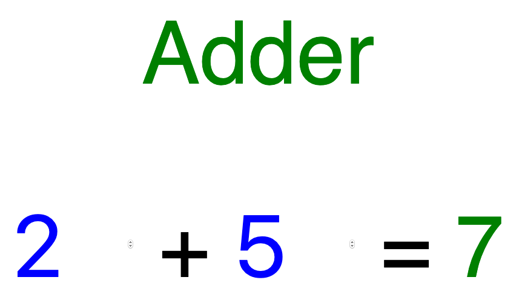
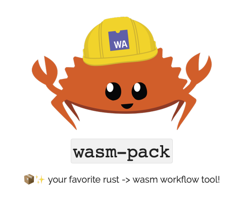
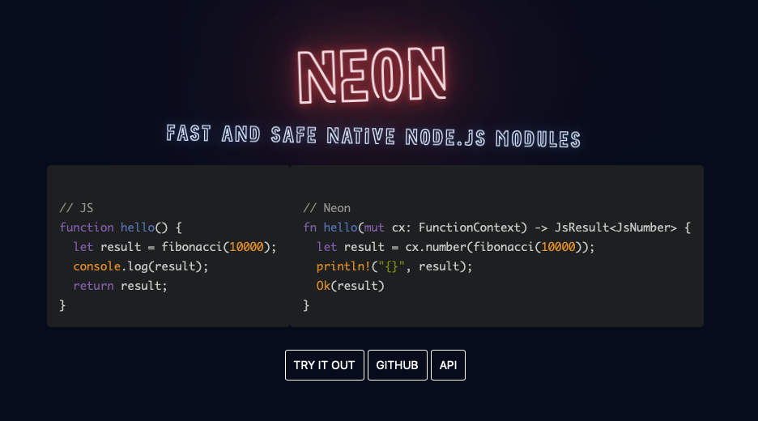
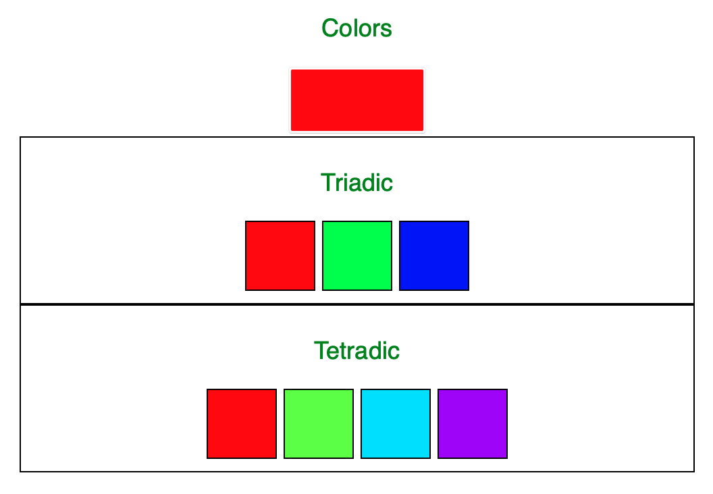

footer: https://github.com/hoop33/cotb_wasm
slidenumbers: true

# Why the Web Wants WebAssembly

## Rob Warner


* GitHub: @hoop33
* Twitter: @hoop33
* Email: hoop33@gmail.com
* Blog: https://grailbox.com

---

## Browser Support

* Chrome
* Edge
* Firefox
* Opera
* Safari

---

## What Is WebAssembly?

> "WebAssembly ... is a binary instruction format for a stack-based virtual machine."

https://webassembly.org

---

## WebAssembly Features

* Binary instruction format
* Stack-based
* Portable
* Hosted

---

## Sound Familiar?


---

## How Is WebAssembly Different?

* Still around
* Standards-based (W3C)
* Supports multiple languages
* Integrated with JavaScript
* Sandboxed
* Efficient

---

## Yeah, But Why?

> "So for sure, WebAssembly is faster (50x)"

(Ok, warning, clickbait)

https://www.ebayinc.com/stories/blogs/tech/webassembly-at-ebay-a-real-world-use-case/

---

## Why Not Just JavaScript

* Performance
* Competition
* Choice
* Reuse

---

## Tools

* WebAssembly Studio
  * https://webassembly.studio/
* The WebAssembly Binary Toolkit 
  * https://github.com/WebAssembly/wabt

---

## WASM Data Types

* `i32`
* `i64`
* `f32`
* `f64`

---

## First Project: Adder

* `wasm` function to add two integers
* Page to input numbers and display sum
* JavaScript to load module and call function
* CSS to add mediocre styling



---

## Add Function

```lisp
(module
  (func $add (param $lhs i32) (param $rhs i32) (result i32)
    get_local $lhs
    get_local $rhs
    i32.add)
  (export "add" (func $add))
)
```

---

## HTML

```html
<input type="number" id="lhs" min="0" value="0">
+
<input type="number" id="rhs" min="0" value="0">
=
<span id="sum">0</span>
```

---

## JavaScript

```javascript
fetch('./add.wasm')
  .then(response => response.arrayBuffer())
  .then(bytes => WebAssembly.instantiate(bytes))
  .then(results => {
    const instance = results.instance;
    // Set event listener here (next slide)
  })
  .catch(console.error);
```

---

## JavaScript (cont)

```javascript
const lhs = document.getElementById('lhs');
const rhs = document.getElementById('rhs');

const adder = () => {
  document.getElementById('sum').textContent = instance.exports.add(
    parseInt(lhs.value),
    parseInt(rhs.value),
  );
};

lhs.addEventListener('change', adder);
rhs.addEventListener('change', adder);
```

---

## Rust History

* Graydon Hoare, 2006
* Mozilla, 2009
* 1.0, 2015

---

## Why Rust?

* Small binaries
* Fast
* Great tooling
* Memory safe
* "Most loved"

---

## Rust for JavaScript Developers

`npm` → `cargo`
`package.json` → `Cargo.toml`
`npm_modules` → crates

* Modules
* Ownership
* Lifetimes
* snake_case

---

## Rust WebAssembly Tools




---

## Colors



---

## Setup

* Install Rust
* Install `wasm32-unknown-unknown` target
* Install `wasm-pack`
* Install `cargo-generate`
* Install `npm`

---

## Create Project

```sh
$ cargo generate --git https://github.com/rustwasm/wasm-pack-template
🤷  Project Name: colors
🔧   Creating project called `colors`...
✨   Done! New project created /Users/rwarner/Development/colors
```

---

## Cargo.toml

```toml
[package]
name = "colors"
version = "0.1.0"
authors = ["Rob Warner <rwarner@grailbox.com>"]
edition = "2018"

[lib]
crate-type = ["cdylib", "rlib"]

[features]
default = ["console_error_panic_hook"]

[dependencies]
wasm-bindgen = "0.2"
console_error_panic_hook = { version = "0.1.1", optional = true }
wee_alloc = { version = "0.4.2", optional = true }

[dev-dependencies]
wasm-bindgen-test = "0.2"

[profile.release]
opt-level = "s"
```

---

## Rust Source

```
src
├── lib.rs
└── utils.rs
tests
└── web.rs
```

---

## Import / Export

```rust
#[wasm_bindgen]
extern {
    fn alert(s: &str);
}

#[wasm_bindgen]
pub fn greet() {
    alert("Hello, colors!");
}
```

---

## Build Module

```sh
$ wasm-pack build
```

Files

```
pkg
├── README.md
├── colors.d.ts
├── colors.js
├── colors_bg.d.ts
├── colors_bg.wasm
└── package.json
```

---

## Build Web App

```sh
$ npm init wasm-app www
npx: installed 1 in 2.104s
🦀 Rust + 🕸 Wasm = ❤
```

---

## Add Module

```json
"dependencies": {
  "colors": "file:../pkg"
}
```

---

## HTML

```html
<body>
  <div class="content">
    <p>Colors</p>
    <input type="color" id="base">

    <div class="palette">
      <p>Triadic</p>
      <span class="well" id="triad1"></span>
      <span class="well" id="triad2"></span>
      <span class="well" id="triad3"></span>
    </div>

  </div>
  <script src="./bootstrap.js"></script>
</body>
```

---

## JavaScript

```javascript
import * as colors from 'colors';

const base = document.getElementById('base');
const triad1 = document.getElementById('triad1');
const triad2 = document.getElementById('triad2');
const triad3 = document.getElementById('triad3');

base.addEventListener('change', event => {
  const bc = event.srcElement.value;
  triad1.style.backgroundColor = bc;
  triad2.style.backgroundColor = colors.spin(bc, 120);
  triad3.style.backgroundColor = colors.spin(bc, 240);
});
```

---

## Further Reading

* https://webassembly.org
* https://rustwasm.github.io/wasm-pack/
* https://neon-bindings.com
* https://github.com/rustwasm/book

---

## Further Reading (cont) 

* _Programming WebAssembly with Rust_ by Kevin Hoffman
* https://github.com/mbasso/awesome-wasm
* https://github.com/appcypher/awesome-wasm-langs
* https://github.com/WebAssembly/binaryen (`wasm2js`)
* https://doc.rust-lang.org/book/

---

## Rob Warner

* GitHub: @hoop33
* Twitter: @hoop33
* Email: hoop33@gmail.com
* Blog: https://grailbox.com
* Repo: https://github.com/hoop33/cotb_wasm
