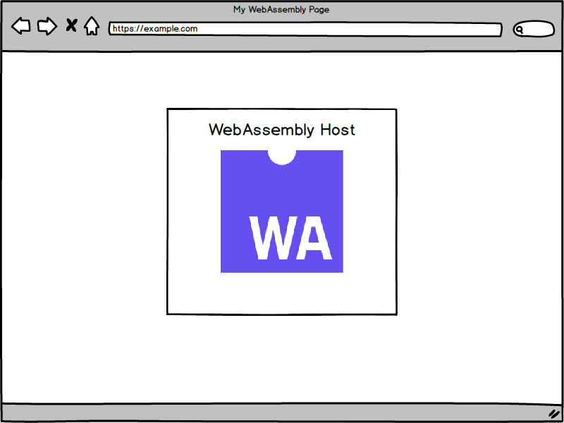
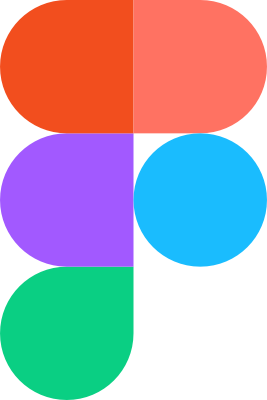
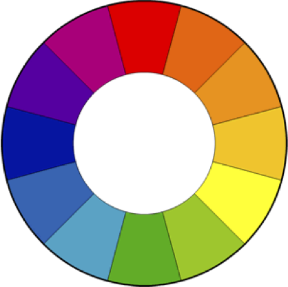
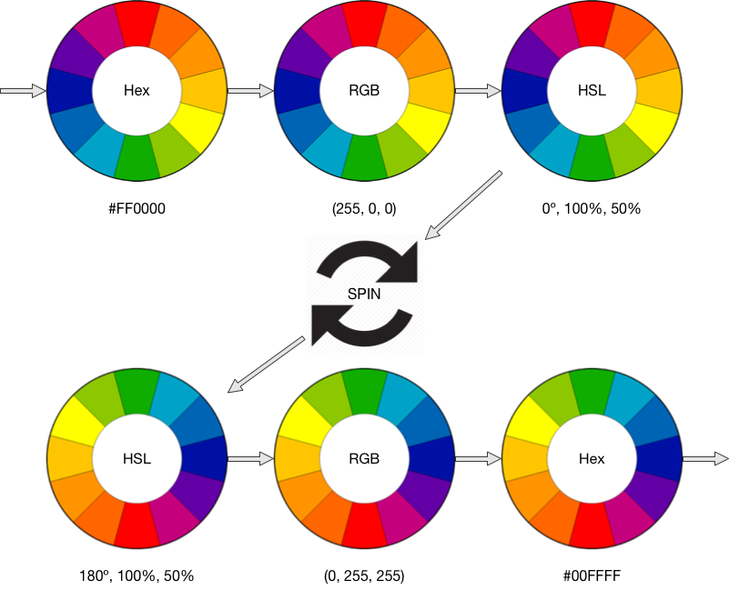
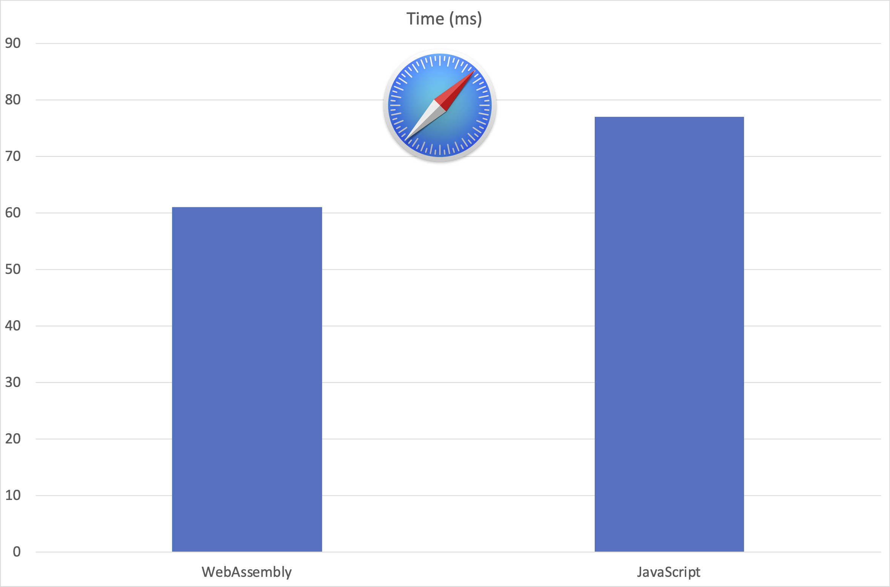
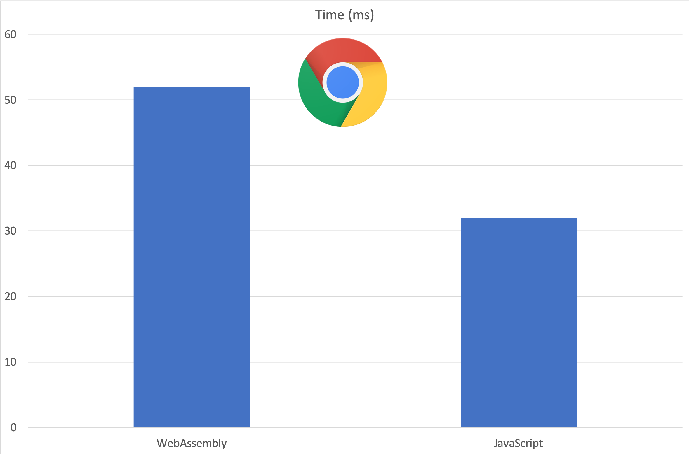
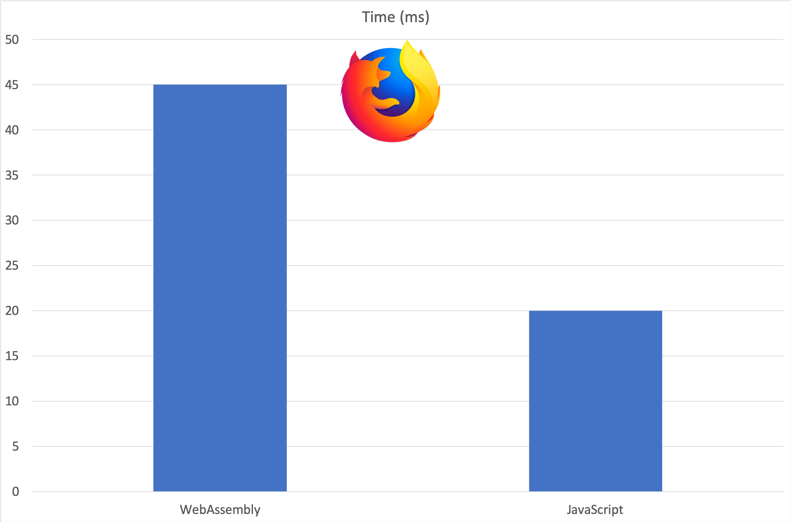

theme: Grailbox
footer: 
slidenumbers: true

# Why the Web Wants WebAssembly

## Rob Warner


* GitHub: @hoop33
* Twitter: @hoop33
* Email: hoop33@gmail.com
* Blog: https://grailbox.com
* Repo: https://github.com/hoop33/cotb_wasm

[.slidenumbers: false]

---

## Overview

* What is WebAssembly?
* WebAssembly Use Cases
* Adder: Writing in `wat`
* Using Rust and `wasm-pack`

---

## What Is WebAssembly?

> "WebAssembly ... is a binary instruction format for a stack-based virtual machine."



---

## WebAssembly Features

* Binary instruction format
* Stack-based
* Hosted
* Portable

---


[.slidenumbers: false]
[.hide-footer]

---

## How Is WebAssembly Different?

* Still around
* Standards-based (W3C)
* Supports multiple languages
* Integrates with JavaScript
* Sandboxed
* Efficient

---

## Browser Support


Use `wasm2js` for IE

---

## Yeah, But Why?

> "So for sure, WebAssembly is faster (50x)"
> "How We Used WebAssembly To Speed Up Our Web App By 20X (Case Study)"
> "WebAssembly cut Figma's load time by 3x"




---

## Why Wouldn't I Just Use JavaScript?

* Performance
* Competition
* Choice
* Reuse existing libraries

---

## Use Cases

* Full applications
* Frame in WebAssembly, UI in HTML/JavaScript
* Functions / Code called by JavaScript

---


[.slidenumbers: false]
[.hide-footer]

---


[.slidenumbers: false]
[.hide-footer]

---


[.slidenumbers: false]
[.hide-footer]

---

## WASM Data Types

* `i32`
* `i64`
* `f32`
* `f64`

---

## First Project: Adder

* `wasm` function to add two integers
* Page to input numbers and display sum
* JavaScript to load module and call function
* CSS to add mediocre styling


---

## Add Function

```lisp
(module
  (func $add (param $lhs i32) (param $rhs i32) (result i32)
    get_local $lhs
    get_local $rhs
    i32.add)
  (export "add" (func $add))
)
```

---

## HTML

```html
<div class="content">
  <p>Adder</p>
  <input type="number" id="lhs" min="0" value="0">
  +
  <input type="number" id="rhs" min="0" value="0">
  =
  <span id="sum">0</span>
</div>
<script src="./adder.js"></script>
```

---

## JavaScript

```javascript
fetch('./add.wasm')
  .then(response => response.arrayBuffer())
  .then(bytes => WebAssembly.instantiate(bytes))
  .then(results => {
    setEventListener(results.instance);
  })
  .catch(console.error);
```

---

## JavaScript (cont)

```javascript
function setEventListener(wasm) {
  const lhs = document.getElementById('lhs');
  const rhs = document.getElementById('rhs');

  const adder = () => {
    document.getElementById('sum').textContent = 
      wasm.exports.add(parseInt(lhs.value), parseInt(rhs.value));
  };

  lhs.addEventListener('change', adder);
  rhs.addEventListener('change', adder);
}
```

---

## Why Rust for WebAssembly?

* Mozilla-backed
* Small binaries / faster download, parsing, etc.
* Fast
* Great tooling
* Memory safe
* "Most loved"

---

## Rust for JavaScript Developers

`npm` → `cargo`
`package.json` → `Cargo.toml`
`node_modules` → crates

---


[.slidenumbers: false]
[.hide-footer]

---

## Colors


---


[.slidenumbers: false]
[.hide-footer]

---

## Calculating Colors



* Hue (0 - 359º)
* Saturation (0 - 100%)
* Lightness (0 - 100%)

---

## How to Spin



---

## Cargo.toml

```toml
[package]
name = "colors"
version = "0.1.0"
authors = ["Rob Warner <rwarner@grailbox.com>"]
edition = "2018"

[lib]
crate-type = ["cdylib", "rlib"]

[dependencies]
wasm-bindgen = "0.2"
```

---

## Rust Source

```
src
├── lib.rs
└── utils.rs
tests
└── web.rs
```

---

## Import / Export

```rust
#[wasm_bindgen]
extern {
    fn alert(s: &str);
}

#[wasm_bindgen]
pub fn greet() {
    alert("Hello, colors!");
}
```

---

## Spin (Rust)

```rust
#[wasm_bindgen]
pub fn spin(color: &str, degrees: i32) -> String {
    let spin_degrees = normalize_degrees(degrees);
    let (r, g, b) = hex_to_rgb(color);
    let (h, s, l) = rgb_to_hsl(r, g, b);
    let hspin = normalize_spin(h, spin_degrees);
    let (sr, sg, sb) = hsl_to_rgb(hspin, s, l);
    rgb_to_hex(sr, sg, sb)
}
```

---

## Colors.js

```javascript
export function spin(color, degrees) {
    const ptr0 = passStringToWasm(color);
    const len0 = WASM_VECTOR_LEN;
    const retptr = globalArgumentPtr();
    try {
        wasm.spin(retptr, ptr0, len0, degrees);
        const mem = getUint32Memory();
        const rustptr = mem[retptr / 4];
        const rustlen = mem[retptr / 4 + 1];

        const realRet = getStringFromWasm(rustptr, rustlen).slice();
        wasm.__wbindgen_free(rustptr, rustlen * 1);
        return realRet;
    } finally {
        wasm.__wbindgen_free(ptr0, len0 * 1);
    }
}
```

---

## Spin (JavaScript)

```javascript
export function spin(color, degrees) {
  const spinDegrees = normalizeDegrees(degrees);
  const {r, g, b} = hexToRGB(color);
  const {h, s, l} = rgbToHSL(r, g, b);
  const hspin = normalizeSpin(h, spinDegrees);
  const {sr, sg, sb} = hslToRGB(hspin, s, l);
  return rgbToHex(sr, sg, sb);
}
```

---

## Build Web App

```sh
$ npm init wasm-app www
npx: installed 1 in 2.104s
🦀 Rust + 🕸 Wasm = ❤
```

---

## Add Module

```json
"dependencies": {
  "colors": "file:../pkg",
  "jscolors": "file:../../jscolors"
}
```

---

## HTML

```html
<body>
  <div class="content">
    <p>Colors</p>
    <input type="color" id="base">

    <div class="palette">
      <p>WebAssembly Triadic</p>
      <span class="well" id="triad1"></span>
      <span class="well" id="triad2"></span>
      <span class="well" id="triad3"></span>
    </div>

  </div>
  <script src="./bootstrap.js"></script>
</body>
```

---

## JavaScript

```javascript
import * as colors from 'colors';

const base = document.getElementById('base');

const triad1 = document.getElementById('triad1');
const triad2 = document.getElementById('triad2');
const triad3 = document.getElementById('triad3');

base.addEventListener('change', event => {
  const bc = event.srcElement.value;

  triad1.style.backgroundColor = bc;
  triad2.style.backgroundColor = colors.spin(bc, 120);
  triad3.style.backgroundColor = colors.spin(bc, 240);
});
```

---



[.slidenumbers: false]
[.hide-footer]

---



[.slidenumbers: false]
[.hide-footer]

---



[.slidenumbers: false]
[.hide-footer]

---

## Tools

* WebAssembly Studio
    * https://webassembly.studio/
* The WebAssembly Binary Toolkit
    * https://github.com/WebAssembly/wabt
* wasm-pack
    * https://rustwasm.github.io/wasm-pack/

---

## Further Reading

* https://webassembly.org
* https://github.com/rustwasm/book
* https://neon-bindings.com
* https://www.ebayinc.com/stories/blogs/tech/webassembly-at-ebay-a-real-world-use-case/

---

## Further Reading (cont) 

* https://www.smashingmagazine.com/2019/04/webassembly-speed-web-app/
* https://www.figma.com/blog/webassembly-cut-figmas-load-time-by-3x/
* https://github.com/shamadee/web-dsp
* _Programming WebAssembly with Rust_ by Kevin Hoffman

---

## Further Reading (cont) 

* https://github.com/mbasso/awesome-wasm
* https://github.com/appcypher/awesome-wasm-langs
* https://github.com/WebAssembly/binaryen (`wasm2js`)
* https://doc.rust-lang.org/book/
* https://rsms.me/wasm-intro
* https://github.com/hoop33/hc

---

## Rob Warner

* GitHub: @hoop33
* Twitter: @hoop33
* Email: hoop33@gmail.com
* Blog: https://grailbox.com
* Repo: https://github.com/hoop33/cotb_wasm
